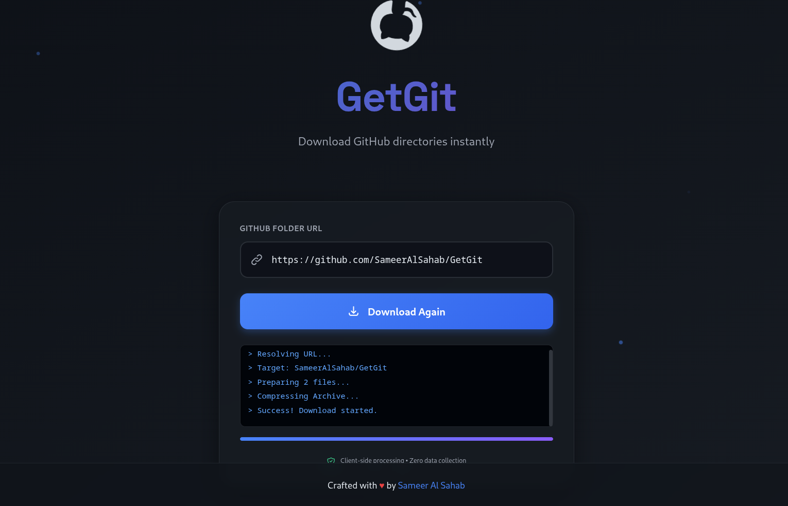

  

<h1 align="center">GetGit</h1>
The fastest, cleanest way to download specific GitHub sub-directories without cloning the whole repo.

### Features
- **Zero Server Overhead:** Everything is zipped in own browser. Your data never touches a middle server.
- **Bypass Limits:** Uses the Git Tree API and Raw content fetching to maximize download speeds and minimize rate limits.
- **Safe & Secure:** No tracking, no data collection. Just you and the GitHub API.

  

### How it works
1. **Paste** the URL of the folder you want.
2. **GetGit** goes to the GitHub API to map out the folder structure.
3. The app fetches the "Raw" version of each file.
4. **JSZip** bundles them up and triggers a local download.

### Acknowledgements
This project was inspired by DownGit, created by Minhas Kamal. A brother from my own country (Bangladesh 🇧🇩) who made this a decade ago. It helped thousands of people. GetGit is just my attempt to bring that same idea into a new look and some new workarounds. Big respect to the OG!

Built with ❤️ by [Sameer Al Sahab](https://github.com/SameerAlSahab)
